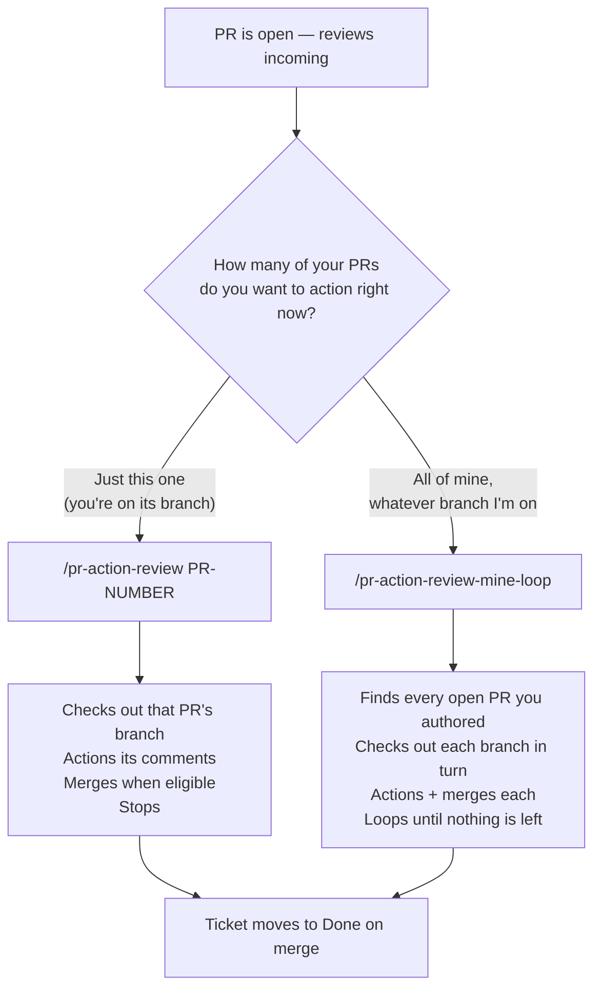
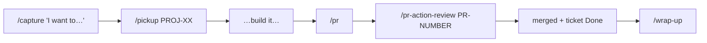
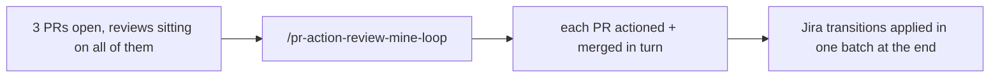

# Which PR review command do I run?

One decision: **am I finishing the one PR I'm sitting on, or clearing everything I've got open?**

**Rule of thumb:** if you can name the PR number, use `pr-action-review`. The loop is a batch tool — it walks
_all_ your open PRs and will check out other branches to do it. Don't reach for it just because you happen to be
on a branch with one PR.

## The normal single-ticket flow

`/pr --watch` collapses the last two steps: it opens the PR, waits for the first review to land, then runs
`pr-action-review` for you automatically. Same thing, one less command. Without `--watch`, `/pr` _offers_ to
watch and you say yes — the flag just skips the question.

## The batch flow

Use this when you've stacked up work and want it all landed — typically first thing in the morning, or after a
review sweep from the team.

## Corrections to the version doing the rounds

| Claim                               | Reality                                                                                                                                                                                         |
| ----------------------------------- | ----------------------------------------------------------------------------------------------------------------------------------------------------------------------------------------------- |
| `/wrap-up` "merges everything in"   | It does **not** merge anything. It switches to `main`, pulls, and deletes the finished feature branch. Merging happens in `pr-action-review` (or the loop). That's why the PR looked untouched. |
| Use the loop to watch one PR        | The loop isn't a watcher. For one PR use `/pr --watch`, or `/pr-action-review <number>` once a review is in.                                                                                    |
| `/pr-review-loop` is the same thing | Different command, opposite direction — it reviews **other people's** PRs. `pr-action-review*` acts on **yours**.                                                                               |

## Cheat sheet

| I want to…                                    | Command                         |
| --------------------------------------------- | ------------------------------- |
| Action reviews on one specific PR             | `/pr-action-review <pr-number>` |
| Open a PR and have it self-drive to merge     | `/pr --watch`                   |
| Land every open PR I own                      | `/pr-action-review-mine-loop`   |
| Review my teammates' PRs                      | `/pr-review-loop`               |
| Tidy up after a merge (branch + back to main) | `/wrap-up`                      |
